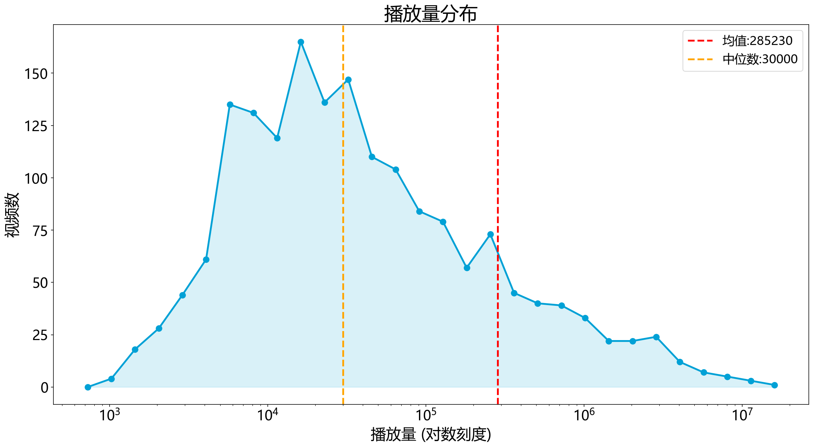
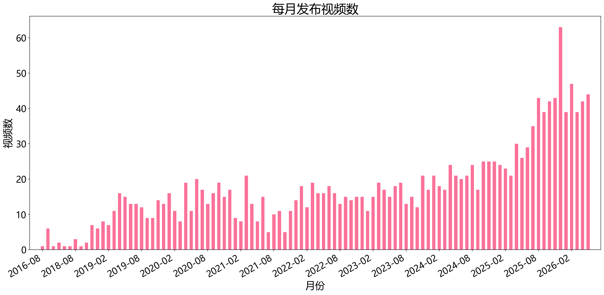
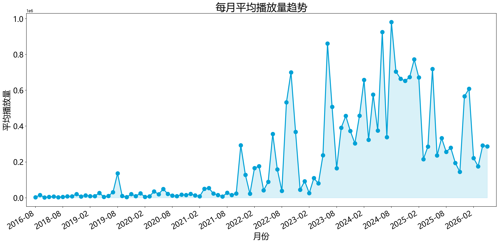
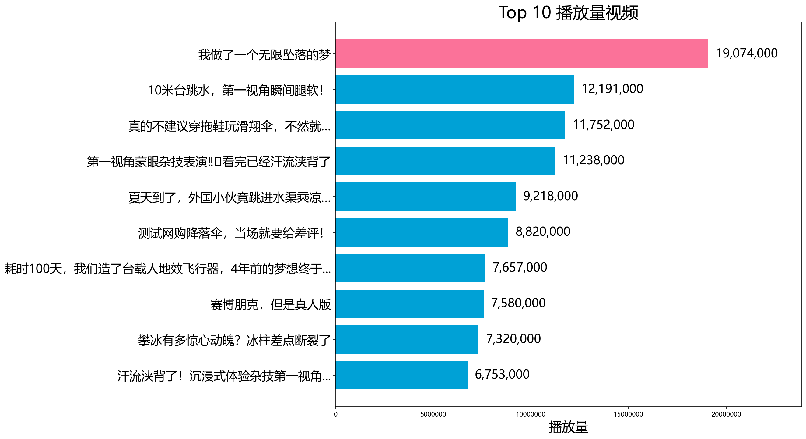
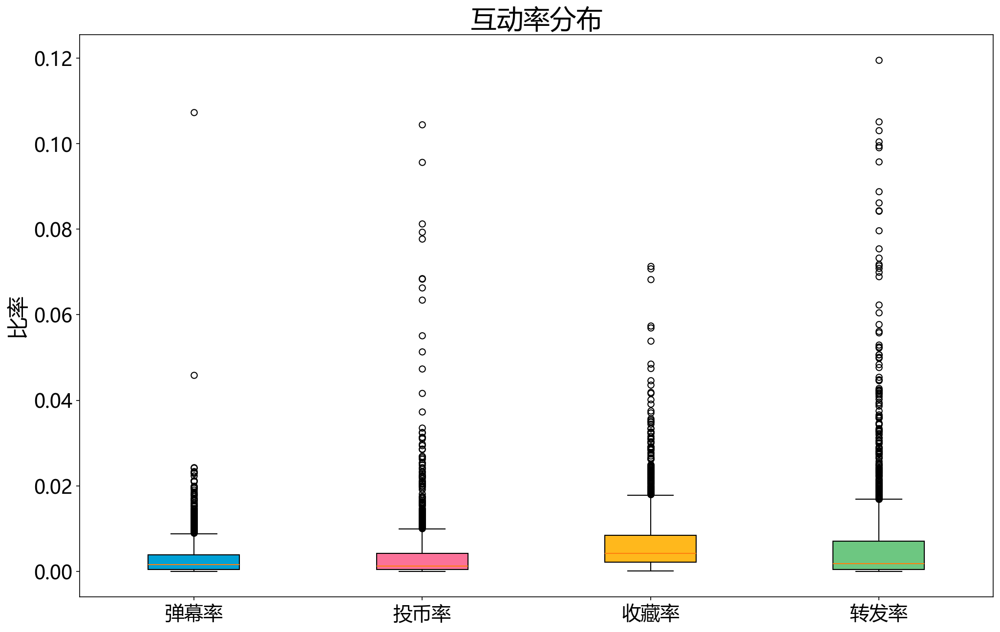
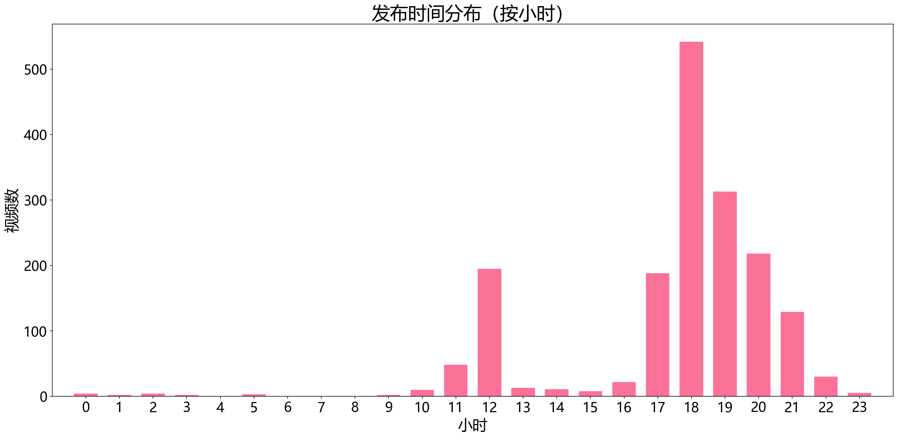
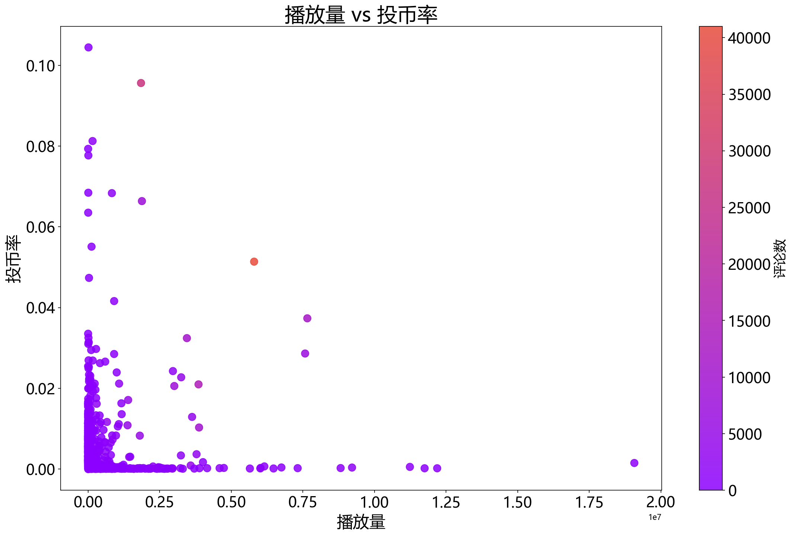

# UID:39279965 数据分析报告

**数据获取日期**:2026-05-27 19:17:58
**总视频数**: 1749

## 基础数据

- 昵称: 影石Insta360
- 粉丝数: 715,431
- 获赞数: 15,515,781
- 播放数: 410,284,264

## 播放量统计

| 指标 | 数值 |
|------|------|
| 均值 | 285230 |
| 中位数 | 30000 |
| 最高 | 19074000 |
| 最低 | 612 |

## 播放量 Top 5

1. **我做了一个无限坠落的梦** — 19,074,000 播放
2. **10米台跳水，第一视角瞬间腿软！** — 12,191,000 播放
3. **真的不建议穿拖鞋玩滑翔伞，不然就…** — 11,752,000 播放
4. **第一视角蒙眼杂技表演‼️看完已经汗流浃背了** — 11,238,000 播放
5. **夏天到了，外国小伙竟跳进水渠乘凉…** — 9,218,000 播放

## 月度趋势

| 月份 | 发布数 | 平均播放量 |
|------|--------|------------|
| 2016-08 | 1 | 2,570 |
| 2016-09 | 6 | 15,829 |
| 2016-11 | 1 | 1,935 |
| 2017-04 | 2 | 5,208 |
| 2017-10 | 1 | 7,105 |
| 2018-07 | 1 | 3,421 |
| 2018-08 | 3 | 4,903 |
| 2018-09 | 1 | 8,450 |
| 2018-10 | 2 | 8,228 |
| 2018-11 | 7 | 21,174 |
| 2018-12 | 6 | 7,056 |
| 2019-01 | 8 | 13,921 |
| 2019-02 | 7 | 9,047 |
| 2019-03 | 11 | 9,560 |
| 2019-04 | 16 | 27,248 |
| 2019-05 | 15 | 5,055 |
| 2019-06 | 13 | 10,714 |
| 2019-07 | 13 | 31,535 |
| 2019-08 | 12 | 136,193 |
| 2019-09 | 9 | 10,725 |
| 2019-10 | 9 | 3,798 |
| 2019-11 | 14 | 20,386 |
| 2019-12 | 13 | 9,346 |
| 2020-01 | 16 | 25,171 |
| 2020-02 | 11 | 5,516 |
| 2020-03 | 8 | 8,612 |
| 2020-04 | 19 | 35,317 |
| 2020-05 | 11 | 20,064 |
| 2020-06 | 20 | 49,631 |
| 2020-07 | 17 | 21,637 |
| 2020-08 | 13 | 11,873 |
| 2020-09 | 16 | 9,690 |
| 2020-10 | 19 | 17,134 |
| 2020-11 | 15 | 15,125 |
| 2020-12 | 17 | 22,049 |
| 2021-01 | 9 | 13,155 |
| 2021-02 | 8 | 8,481 |
| 2021-03 | 21 | 49,810 |
| 2021-04 | 13 | 54,498 |
| 2021-05 | 8 | 23,468 |
| 2021-06 | 15 | 15,728 |
| 2021-07 | 5 | 7,466 |
| 2021-08 | 10 | 27,633 |
| 2021-09 | 11 | 15,907 |
| 2021-10 | 5 | 24,171 |
| 2021-11 | 11 | 293,262 |
| 2021-12 | 14 | 128,531 |
| 2022-01 | 18 | 22,628 |
| 2022-02 | 12 | 166,167 |
| 2022-03 | 19 | 175,884 |
| 2022-04 | 16 | 42,256 |
| 2022-05 | 16 | 89,088 |
| 2022-06 | 18 | 356,509 |
| 2022-07 | 16 | 158,866 |
| 2022-08 | 13 | 38,738 |
| 2022-09 | 15 | 532,343 |
| 2022-10 | 14 | 700,123 |
| 2022-11 | 15 | 367,585 |
| 2022-12 | 15 | 45,031 |
| 2023-01 | 11 | 92,784 |
| 2023-02 | 15 | 26,000 |
| 2023-03 | 19 | 109,641 |
| 2023-04 | 17 | 80,368 |
| 2023-05 | 15 | 236,935 |
| 2023-06 | 18 | 860,889 |
| 2023-07 | 19 | 507,849 |
| 2023-08 | 13 | 164,557 |
| 2023-09 | 15 | 390,547 |
| 2023-10 | 12 | 456,750 |
| 2023-11 | 21 | 372,556 |
| 2023-12 | 17 | 303,402 |
| 2024-01 | 21 | 457,714 |
| 2024-02 | 18 | 657,444 |
| 2024-03 | 17 | 323,153 |
| 2024-04 | 24 | 576,309 |
| 2024-05 | 21 | 374,899 |
| 2024-06 | 20 | 924,416 |
| 2024-07 | 21 | 338,333 |
| 2024-08 | 24 | 980,419 |
| 2024-09 | 17 | 704,353 |
| 2024-10 | 25 | 664,360 |
| 2024-11 | 25 | 652,389 |
| 2024-12 | 25 | 674,085 |
| 2025-01 | 24 | 772,042 |
| 2025-02 | 23 | 671,609 |
| 2025-03 | 21 | 215,714 |
| 2025-04 | 30 | 285,999 |
| 2025-05 | 26 | 718,692 |
| 2025-06 | 29 | 235,828 |
| 2025-07 | 35 | 333,275 |
| 2025-08 | 43 | 256,147 |
| 2025-09 | 39 | 279,797 |
| 2025-10 | 42 | 194,769 |
| 2025-11 | 43 | 144,941 |
| 2025-12 | 63 | 566,132 |
| 2026-01 | 39 | 608,048 |
| 2026-02 | 47 | 222,096 |
| 2026-03 | 39 | 175,653 |
| 2026-04 | 42 | 291,685 |
| 2026-05 | 44 | 287,149 |

## 图表

